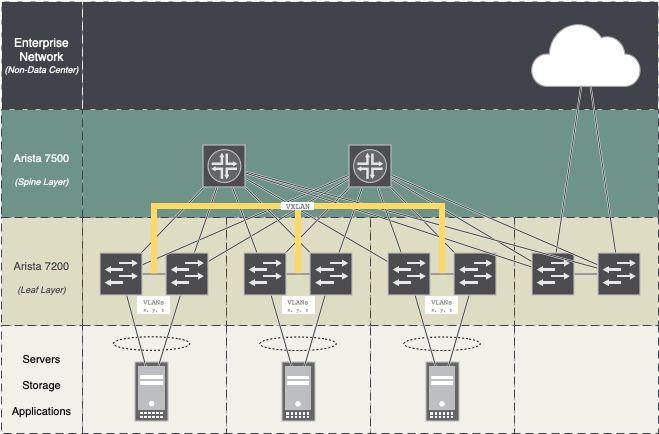

# Arista ATD: Houston 12/06/2018

## Overview

The purpose of this project is three fold:

1. provision the underlay of an Arista spine-leaf data center
2. provision the overlay of VXLAN/EVPN
3. ensure the server hosts are properly configured with LACP bonds

*topology overview*

